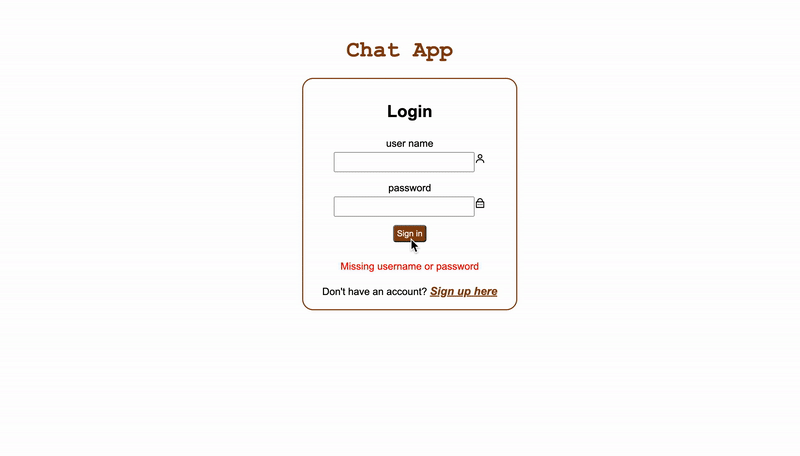

# chatroom

## Description

This is a chat application. Users can signup and login to the chat room and chat with other people.

## Demo

## Usage

1. fork the repo to your local machine
2. `npm install` to install all packages
3. to load database locally, in terminal, `psql postgres` then `\i server/database/schema.sql`
4. `npm start` to start the server, if having error on starting server, please check `server/database/index.js`, change user and/or add password.
5. `npm run build` to compile frontend
6. open browser, enter `localhost:3000`
